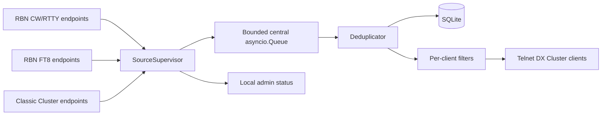

# Architecture

## Overview

`rbn-dxcluster` is an asyncio pipeline:

## Components

- `SourceCategoryConfig` describes a category such as `RBN_CW_RTTY` or `CLASSIC_CLUSTER`.
- `EndpointConfig` describes one feed endpoint and its timeout/rate limit.
- `UpstreamConnector` owns one TCP connection, parser, backoff loop, metrics, and endpoint state.
- `SourceSupervisor` owns all endpoints for one category and enforces the feed strategy.
- `SpotDeduplicator` collapses duplicates and appends endpoint evidence to `supporting_sources`.
- `TelnetDXClusterServer` handles client sessions and DX Cluster-compatible commands.
- `SQLiteStore` persists recent spots and merged source evidence.
- `AdminServer` exposes local `/health`, `/status`, and `/sources` endpoints.

## Feed strategies

- `active_active`: starts all enabled endpoints. This is preferred for redundancy and diversity; dedupe removes repeated output.
- `active_passive`: starts a primary active endpoint and uses backups when no endpoint is active.
- `priority_failover`: prefers the first healthy endpoint and is structured to fail back to higher priority endpoints.

The current failover loop is intentionally conservative and can be extended with active health probes.

## Data model

Every `Spot` carries `source_type`, `endpoint_name`, and `source_instance`. Duplicate merges retain a list of `SourceEvidence` records so stored spots prove which feeds reported the event.

## Security model

Telnet clients are unauthenticated by default to match classic DX Cluster workflows. The server applies max-client limits and bounded queues. The admin HTTP listener binds to localhost by default.

## Error handling and overload

Each endpoint reconnects independently with exponential backoff. A failed feed does not block healthy feeds. Bounded queues drop old/new overload rather than crashing the process.

## Testing model

Unit tests cover parsing, radio helpers, duplicate merging, filters, command parsing, and supervisor endpoint health/strategy behaviour.
